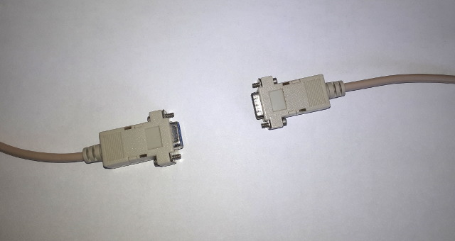

# slay2

## Abstract
*slay2* is a serial communication protocol driver on ISO/OSI layer 2 implemented in C++.
It implements reliable, full duplex, stream based communication on top of a byte orientated interface like UART.
Data is transfered in frames of up to 256 payload bytes, secured by a 8-bit sequence counter and a 32-bit CRC.
Successfully transfered frames are acknowledged by the receiver. Non-acknowledged frames will be automatically
retransmitted.
*slay2* offers up to 256 logical communication channels. The lower the channel number, the higher the transfer
priority.



## Concept
The protocol driver is realized as virtual C++ class **Slay2**. For target adaption, user must derive from this
class and implement the virtual methods:

```
class Slay2
{
   ...
   virtual unsigned int getTime1ms(void) = 0;
   virtual unsigned int getTxCount(void) = 0;
   virtual int transmit(const unsigned char * data, unsigned int len) = 0;
   virtual int receive(unsigned char * buffer, unsigned int size) = 0;
```

**Slay2** serves as factory class to open (create) / close (destroy) communication channels of
type **Slay2Channel**:

```
   Slay2Channel * open(const unsigned int channel);
   void close(Slay2Channel * const channel);
```

The actual communication takes place by means of **Slay2Channel**, using its *send* method and
*receive callback*:

```
class Slay2Channel
{
   ...
   int send(const unsigned char * data, const unsigned int len, const bool more=false);
   void setReceiver(const Slay2Receiver receiver, void * const obj=NULL);
```


## Application Example

```
//main.cpp
#include "slay2.h"
#include "slay2_linux.h"            //Slay2Linux is a target adaption of slay2 for Linux

...

static Slay2Linux slay2;            //Slay2Linux is a child of Slay2 (e.g. Slay2Linux : public Slay2 ...)
static Slay2Channel * slay2ch[3];   //3 logical slay2 communication channels

...

static void onSerialReceive(void * const obj, const unsigned char * const data, const unsigned int len)
{
   Slay2Channel * thiz = (Slay2Channel *)obj; //e.g. you can use "obj" to reference an object instance
   ...
}

static void anotherOSerialReceive(void * const obj, const unsigned char * const data, const unsigned int len)
{
   ...
}

...

int main(int argc, char * argv[])
{
   //optional - if the target adaption requires an initialization....
   slay2.init("/dev/ttyUSB0", 115200);      //this is a Slay2Linux specific method to initialize the tty device

   //open the communication channel 0, and set receive callback (used by channel 0 and 1, with parameter)
   slay2ch[0] = slay2.open(0);
   slay2ch[0]->setReceiver(&onSerialReceive, (void *)slay2ch[0]);

   //open the communication channel 1, and set receive callback (used by channel 0 and 1, with parameter)
   slay2ch[1] = slay2.open(1);
   slay2ch[1]->setReceiver(&onSerialReceive, (void *)slay2ch[1]);

   //open the communication channel 2, and set its own receive callback
   slay2ch[2] = slay2.open(2);
   slay2ch[2]->setReceiver(&anotherOnSerialReceive); //obj will be NULL, because of default parameter


   //enter application loop
   while (true)
   {
      /*
         application logic to send data using
          slay2[...]->send(x, y);
         and receive data using
          the respective callback function
      */

      //process communication
      slay2.task(); //this method must be called cyclically
   }

   ...
```

## Driver Files
Some details of the project structure.

### Base
- slay2.cpp/.h
- slay2_buffer.cpp/.h
- slay2_scheduler.cpp./h

### Target Adaptions
- slay2_nullmodem.cpp/.h (this is an dummy target implementation interconnecting TX an RX (like a nullmode cable does))
- slay2_linux.cpp/.h (target implementation for linux)

### Test and Demo
- slay2_buffer_test.cpp (this is a separate "main" that only tests the buffer implementation)
- main.cpp (this is a demo application using the *nullmodem target*)


## Usage
To use *slay2* add the *base* files to your project. Also add one of the provided targed adaptions
or implement your own.


## Build demo
Build process of the demo application is based on CMake.
On a linux computer follow this procedure:

1. Checkout this project and *cd* to it (e.g. `cd slay2`)
2. Create a build directory (e.g. `mkdir build`)
3. Enter the build directory (e.g. `cd build`)
4. Within the build directory execute `cmake ..`
5. Within the build directory execute `make`
6. Execute the demo usin `./slay2`

